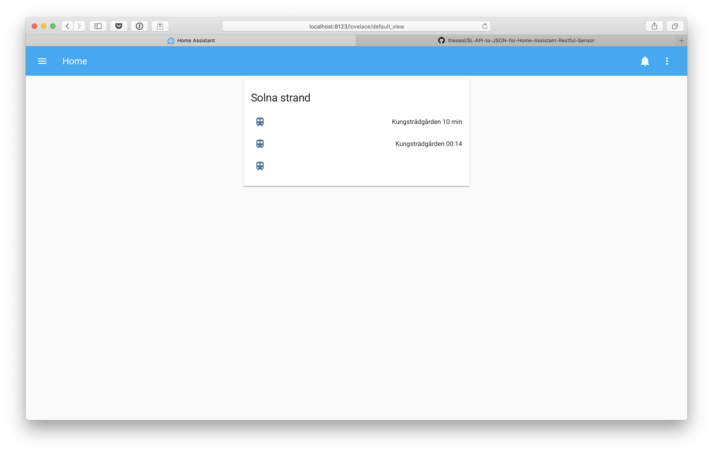

# SL-API-to-JSON-for-Home-Assistant-Restful-Sensor

Supported endpoints
* realtimedeparturesV4

## realtimedeparturesV4
[Documentation from SL](https://www.trafiklab.se/api/sl-realtidsinformation-4).
#### Arguments
* **apiKey** - (required) your API key from Trafiklabs (see documentation above)
* **destinationFilter** - (optional) regexp if you want to see all destinations in the feed
* **stationId** - (required) the station which you want to see real-time depatures from (The ID can be found by searching real-time depatures on SL.se and then notice the ID in the browser location bar.
* **transportMode** - (required) The type of transportation you would like to see in your stream. Supported types are (case sensitve):
  * Buses
  * Metros
  * Trains
  * Trams
  * Ships

#### Screenshot



#### Example
```
$ curl -s 'http://localhost:5000/realtimedeparturesV4?stationId=9326&transportMode=Metros&destinationFilter=Kung&apiKey=SECRETKEY' | jq
{
  "departures": [
    "Kungsträdgården 5 min",
    "Kungsträdgården 23:44"
  ]
}
```

#### Example of Home Assistant configuration
```
sensor:
  - platform: rest
    name: SL REST
    resource: http://localhost:5000/realtimedeparturesV4?stationId=9326&transportMode=Metros&destinationFilter=Kung&apiKey=SECRETKEY
    value_template: '{{ value_json }}'
    scan_interval: 60
    json_attributes:
      - departures
  - platform: template
    sensors:
      first:
        value_template: "{{ states.sensor.sl_rest.attributes['departures'][0] }}"
        friendly_name: ' '
        icon_template: mdi:train
      second:
        value_template: "{{ states.sensor.sl_rest.attributes['departures'][1] }}"
        friendly_name: ' '
        icon_template: mdi:train
      third:
        value_template: "{{ states.sensor.sl_rest.attributes['departures'][2] }}"
        friendly_name: ' '
        icon_template: mdi:train
      fourth:
        value_template: "{{ states.sensor.sl_rest.attributes['departures'][3] }}"
        friendly_name: ' '
        icon_template: mdi:train
```

Patches are welcome!
